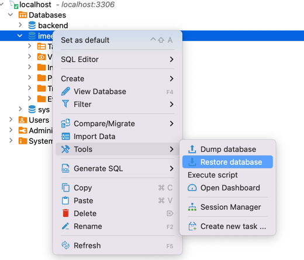

# How to configure 
## Go to file application.properties and configure DB and Redis accordingly
### add new dependencies if you use non-MySQL databases in pom.xml

# How to run 
## Prerequisites
### DB running
### Redis running
## Run IMeetingApplication 
## Prepare databases
### insert data into tables
Or
### import data from file dump-imeeting.sql according to 
#### Note that the default password for admin user whose login name is cat is 123456

# Bug fixes notes for latest MySQL version(8.0)
1. 关闭sql_mode的ONLY_FULL_GROUP_BY[DB config]
   SELECT @@GLOBAL.sql_mode;
   SELECT @@SESSION.sql_mode;
   set @@GLOBAL.sql_mode='STRICT_TRANS_TABLES,NO_ZERO_IN_DATE,NO_ZERO_DATE,ERROR_FOR_DIVISION_BY_ZERO,NO_ENGINE_SUBSTITUTION';
   set @@SESSION.sql_mode='STRICT_TRANS_TABLES,NO_ZERO_IN_DATE,NO_ZERO_DATE,ERROR_FOR_DIVISION_BY_ZERO,NO_ENGINE_SUBSTITUTION';
2. over 关键词转义或重命名[Code change]
